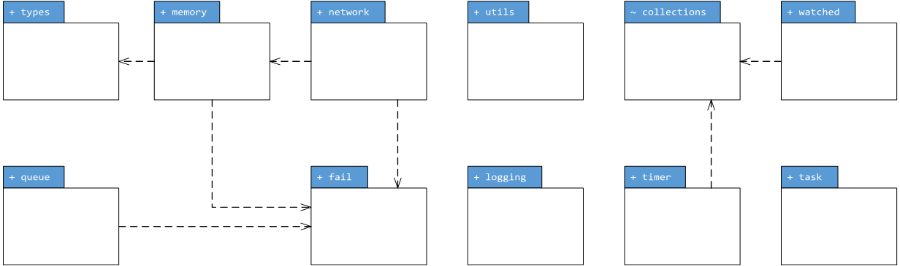
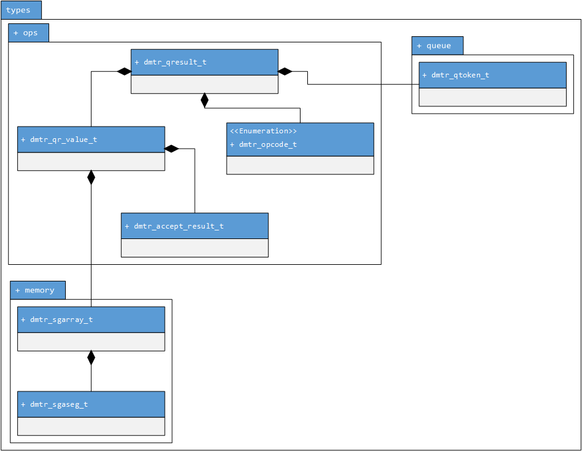
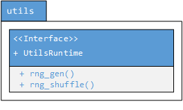
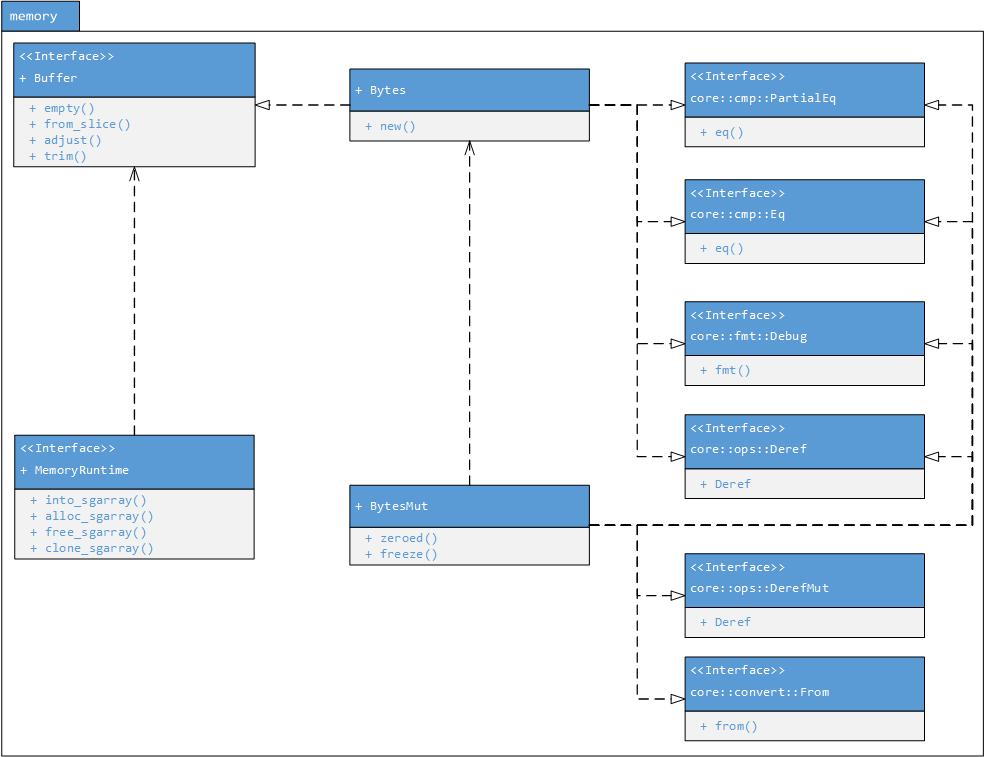
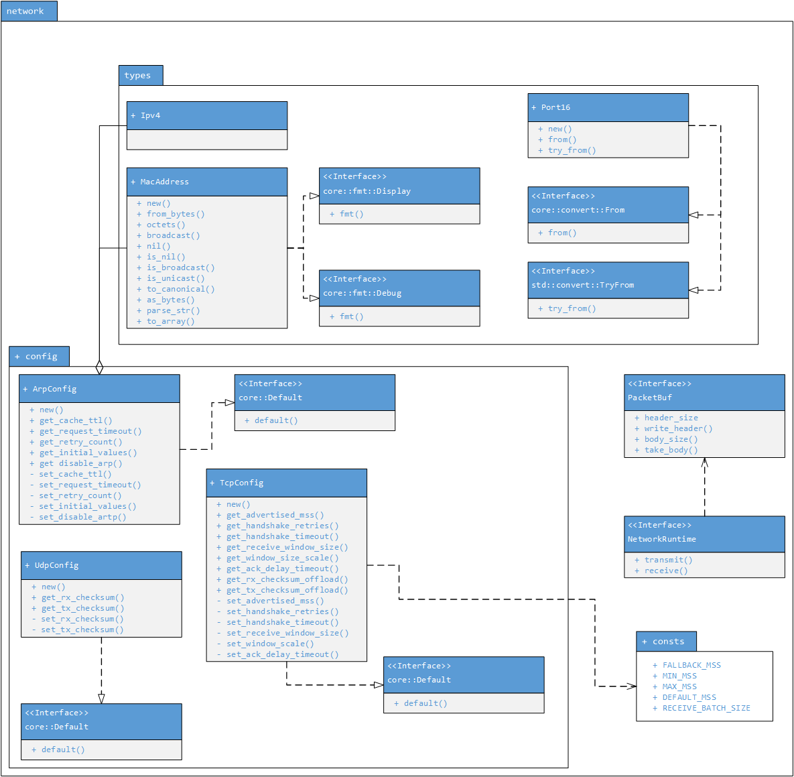
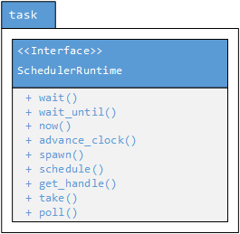

Architectural Diagrams
=======================

- [Package Overview (`runtime`)](#package-overview)
- [Logging Module (`runtime::logging`)](#logging-module)
- [Types Module (`runtime::types`)](#types-module)
- [Utils Module (`runtime::utils`)](#utils-module)
- [Memory Module (`runtime::memory`)](#memory-module)
- [Network Module (`runtime::network`)](#network-module)
- [Queue Module (`runtime::queue`)](#queue-module)
- [Task Module (`runtime::task`)](#task-module)
- [Collections Module (`runtime::collections`)](#collections-module)

Package Overview
-----------------

Logging Module
---------------

Types Module
---------------

Utils Module
-------------

Memory Module
--------------

Network Module
---------------

Queue Module
------------

Task Module
------------

Collections Module
------------
